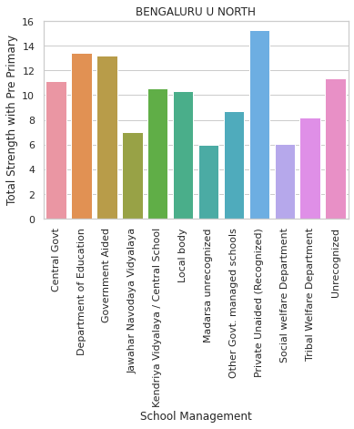
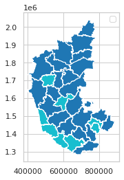
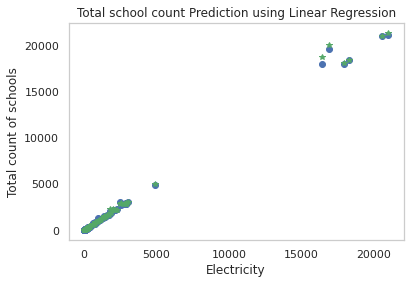
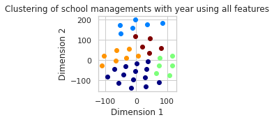

# ANALYSIS OF EDUCATION SYSTEM IN KARNATAKA THROUGH DATA SCIENCE

## Introduction To Problem Statement
Education is one of the most vital parts of our life. India today is the second-largest higher education network in the world. Universities in India are set up by the Central or the State Governments by the means of legislation, while colleges are established by either State Governments or private bodies/trusts. The data associated with it is quite diverse and more or less unstructured. Through proper data analysis, we can get insights into the techniques and measures that can be taken to improve the quality of education in various parts of Karnataka. With this analysis, we hope to understand the trends in the literacy rates and enrollment rates in different categories of schools in various districts of Karnataka and which model of an educational institution is the most successful. In addition to this, we also analyzed the relation between students and teachers to suggest how the teachers should be appointed across all the districts in Karnataka to best help the students.

## About Datasets

Data was collected from the **Unified District Information System for Education** of India. 

[Learn more about UDISE](https://udiseplus.gov.in)

## Machine Learning Algorithms Used

**Linear Regression** - To predict the total number of schools based on the infrastructure equipment supplied for schools.

**Agglomerative Clustering** - Finding the clusters of districts year-wise using the school management feature from the combined dataset.

**TSNE** - For visualizing the cluster of districts ( with different top school categories).

## Data Visualization

Objective 1: Analyzing the district-wise distribution of school categories to find the most successful one in terms of student enrollment.

In Karnataka, in all 34 districts, the school managements that have the highest student enrolment are the Department of Education and Private Unaided (Recognized). This is because people who are capable of affording are more leaned towards Private Unaided (Recognized) whereas people who cannot afford prefer to send their children to government schools under Department of Education as they are providing best possible facilities for the underprivileged students. The school managements that have the lowest student enrolment overall are Other Govt. Managed schools, Jawahar Navodaya Vidyalaya, Madrasa Unrecognized, Madrasa Recognized, Kendriya Vidyalaya, Sainik Schools, and Ministry of labor. Most of these schools are local to only some districts. The geopandas plot shows the best school model for each district. 
Dark Blue - Department of Education
Light Blue - Private Unaided (Recognized)

Objective 2: Analyzing Boys vs Girls education rate.

In all 34 districts, the strength of boys is significantly more than strength of girls in schools from 2012 to 2020 as the population of boys is higher than that of girls in Karnataka. But willingness of boys and girls to study in all districts is almost equal except in the year 2016-17 where boys were more willing to study than girls but it gradually picked up in later years.

Objective 3:  Finding out the trend in the continuity of education for girls in various districts.

As we see here, the schools under the social welfare department have opened the way for SC/ST girls to get a quality education easily without any bias against them in Hassan. There has been an increase from 3.465 (log-transformed value) in 2019 to 5.424 (log-transformed value) in 2020 alone in this department. However, the female student count saw a significant drop in the tribal welfare schools of Hassan in 2020 owing to the pandemic. Department of Education saw such a drop too, although not as high as compared to the tribal welfare department. 
In districts like Koppal, the Social Welfare department has had a consistent drop in female student enrollment since 2012-13. Department of Education, on the other hand, has seen a steady increase despite the pandemic. Almost all the main school management models ('Central Govt', 'Department of Education', 'Government Aided', 'Kendriya Vidyalaya / Central School', 'Private Unaided (Recognized), 'Madarsa recognized (by Wakf board/Madarsa Board)')  have seen a steady count of female students from the years 2019 to 2020 too. Karnataka has announced it will provide free education for girls from kindergarten to postgraduate level, in a bid to raise women’s place in society. The initiative is estimated to encourage 3,70,000 girls to gain a high level of education. The government expects around 18 lakh students whose parent’s income would be less than Rs 10 lakh to opt for this scheme and are planning to earmark ₹110 crores.  They get boarding facilities for each student at the rate of Rs. 1400/- per month for 10 months,  Free Accommodation, Free Uniform, Shoes & Socks, Free Text Books & Stationery, etc.

Objective 4: Understanding the population distribution between rural and urban areas and how one is better than the other.

Karnataka consists of 70 urban and 154 rural assembly constituencies. While nearly half of the urban constituencies are in Bengaluru city (28), the rest are spread across seven city corporations - 43 city municipal councils (CMCs), 65 town municipal councils (TMCs) and 92 town panchayats (TPs). 
 In the Census of India 2011, the definition of urban area adopted is as follows:
 (a) All statutory places with a municipality, corporation, cantonment board or notified town area committee, etc. 
(b) A place satisfying the following three criteria simultaneously:
 i) a minimum population of 5,000; 
ii) at least 75 per cent of male working population engaged in non-agricultural pursuits; and 
iii) a density of population of at least 400 per sq. km. (1,000 per sq. mile). 

For identification of places which would qualify to be classified as 'urban' all villages, which, as per the 2001 Census had a population of 4,000 and above, a population density of 400 persons per sq. km. and having at least 75 per cent of male working population engaged in non-agricultural activity were considered. An area is considered 'Rural' if it is not classified as 'Urban' as per the above definition.

As per our analysis, majority of the districts have more enrollment in rural assembly schools except for those in Bengaluru Urban region where the urban assembly schools (Air Force School, Delhi Public School North,etc) have much better overall enrollment rates for all classes including pre-primary. For example, Bidar has a higher enrollment rate in the rural regions as out of total population of Bidar, 1,890,664 in the district, 425,952 are in urban area and 1,277,348 are in rural area. Bidar has 1459 Govt. schools, of which 1290 are till elementary grade. Department of Education is the most profitable school management model for rural areas and Private Unaided (Recognized) is the best school management model for urban areas of Bidar as per the total count of students over the years. 

On the other hand, Bengaluru Urban district had a population of  9,621,551of which 89.21% is urban, hence the the enrollment rate there is higher. Private Unaided (Recognized) is the best school management model for both the rural and urban areas of Bengaluru Urban district as per the total count of students over the years. 
One thing that puts Bengaluru Urban district on top of the ladder of success in terms of SDG-focused education is the higher no: of enrollment in schools built for social welfare. [Social Welfare Department]. The other districts must implement such models of education too as the rural areas are the ones who are mostly affected by social disparities. Building such departments of schools in those areas can be more beneficial in terms of Human Centric Design plans as students, teachers, parents, and government officials from these places will know the problems better. 

## Machine Learning Algorithms

REGRESSION PLOT TO FIND OUT NUMBER OF SCHOOLS FOR EACH YEAR BASED ON THE INFRASTRUCTURE DATA PROVIDED

The availability of infrastructure facilities is one of the important indicators for assessing whether the schools are providing a conducive learning environment for children or not. RTE Act 2009 has recommended that each school should be equipped with ‘All-weather building consisting of at least one classroom for every teacher and an office-cum-store-cum-Head teacher’s room; barrier free access; separate toilets for boys and girls; safe and adequate drinking water facility to all children; a kitchen where mid-day meal is cooked in the school; playground; arrangements for securing the school building by boundary wall or fencing’. As the number of infrastructure equipment issued by the government or unaided organizations and the total expenditure for their purchase increases, the no: of schools that can use those equipments also increases. Variables representing units available for Electricity , WASH Facility (Drinking Water, Toilet and Handwash), Playground, Complete Medical Checkup, Internet, Computers, Ramps, etc. are used for regression.
We trained our linear regression model with the infrastructural columns as explanatory variables and ‘total_no_of_schools’ as target variable. We got 99.94% accuracy for our testing data. 

LINEAR REGRESSION 

TSNE - TO REDUCE DIMENSIONALITY 
AGGLOMERATIVE/HIERARCHIAL CLUSTERING OF DIFFERENT SCHOOL MANAGEMENT TYPES BASED ON SIMILARITIES

t-SNE is mostly used to understand high-dimensional data and project it into low-dimensional space (like 2D or 3D). It allows us to separate data that cannot be separated by any straight line. Since our dataset has multiple features, we’ve used the t-distributed Stochastic Neighbor Embedding algorithm on it and achieved dimensionality reduction. The local similarities got preserved through this technique.
We then tried to cluster the school management types using agglomerative clustering. This is to get the groups of these management types based on their similarity. Through this, we can make inferences about which of the school management models need a similar type of administration. For example, Jawahar Navodaya Vidyalaya , Local body schools, Railway Schools, Sainik Schools have similar strategy for enrollment, parameters for accreditation,etc. All of these school types have special provisions for students who have parents in the army, railways, or serve as other government service officers. 

TSNE

